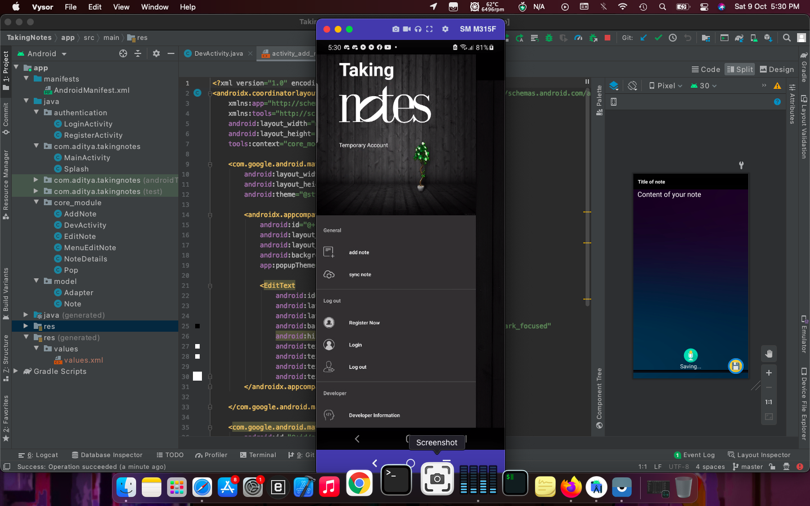
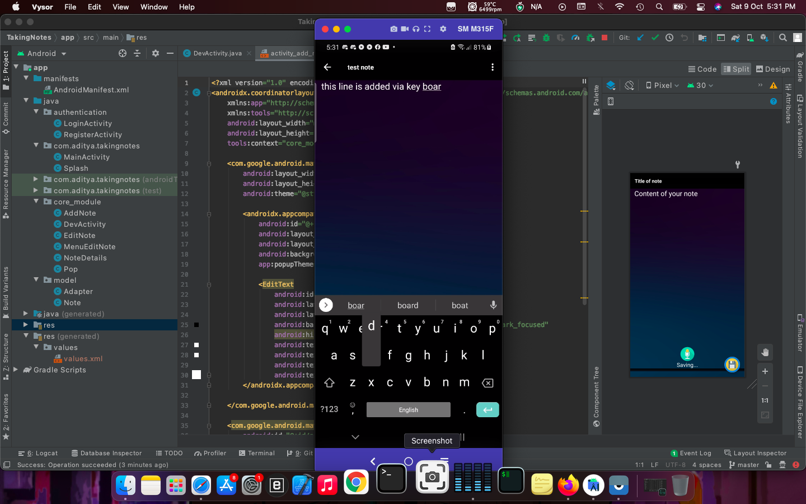
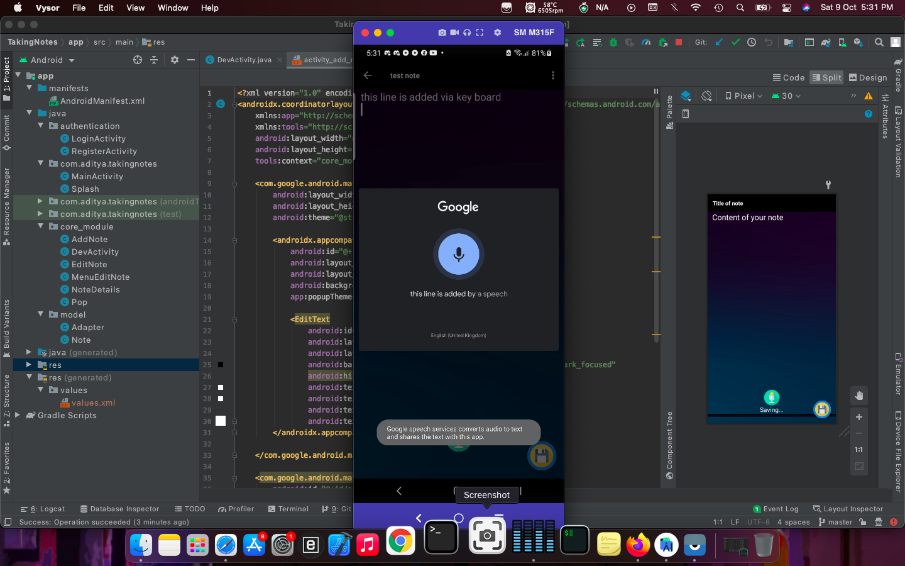
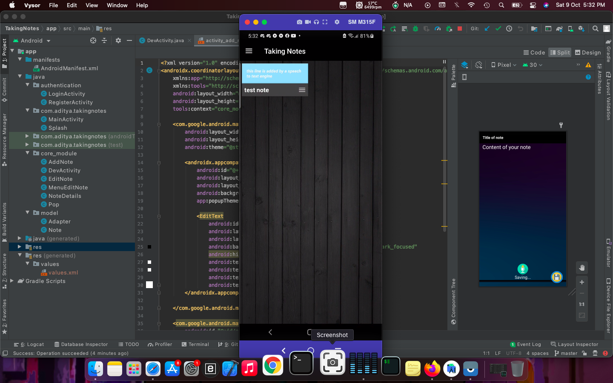
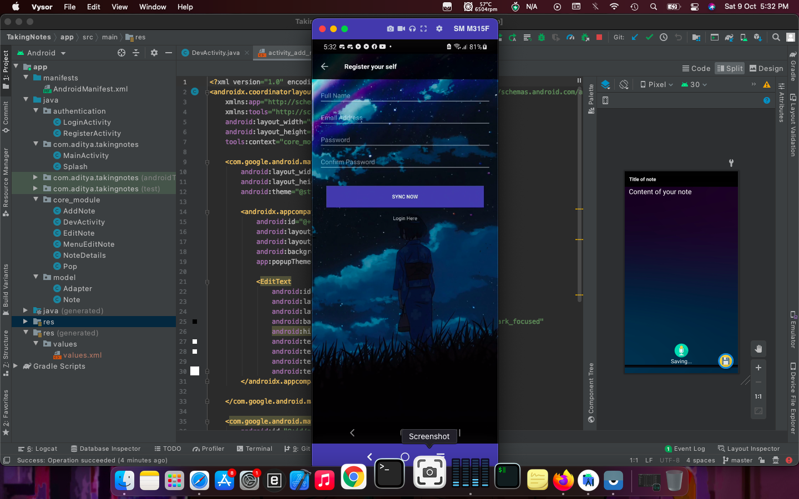
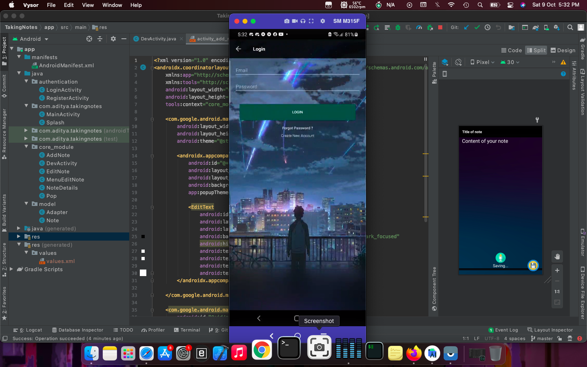
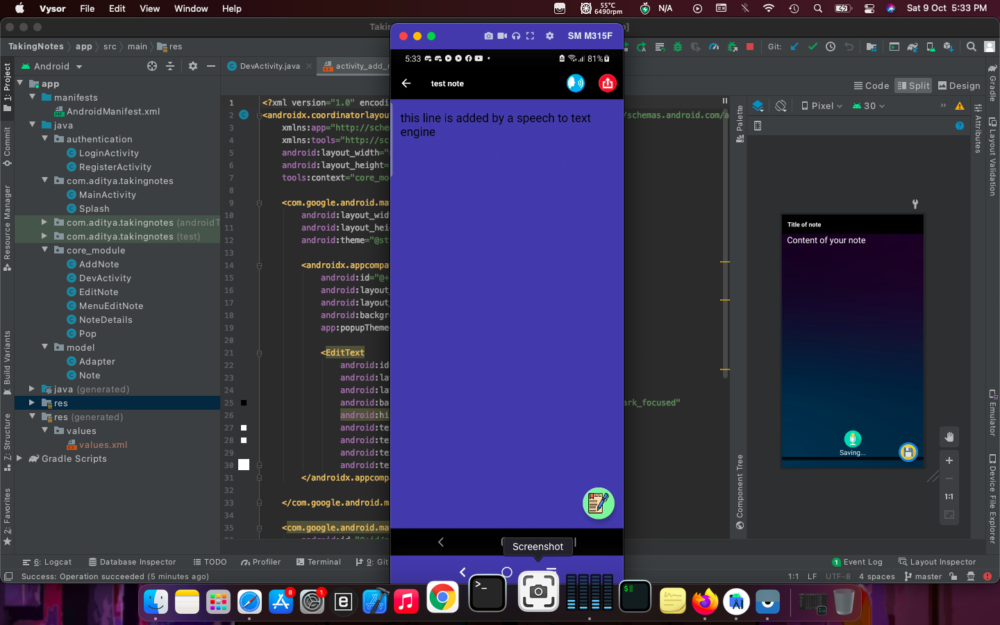
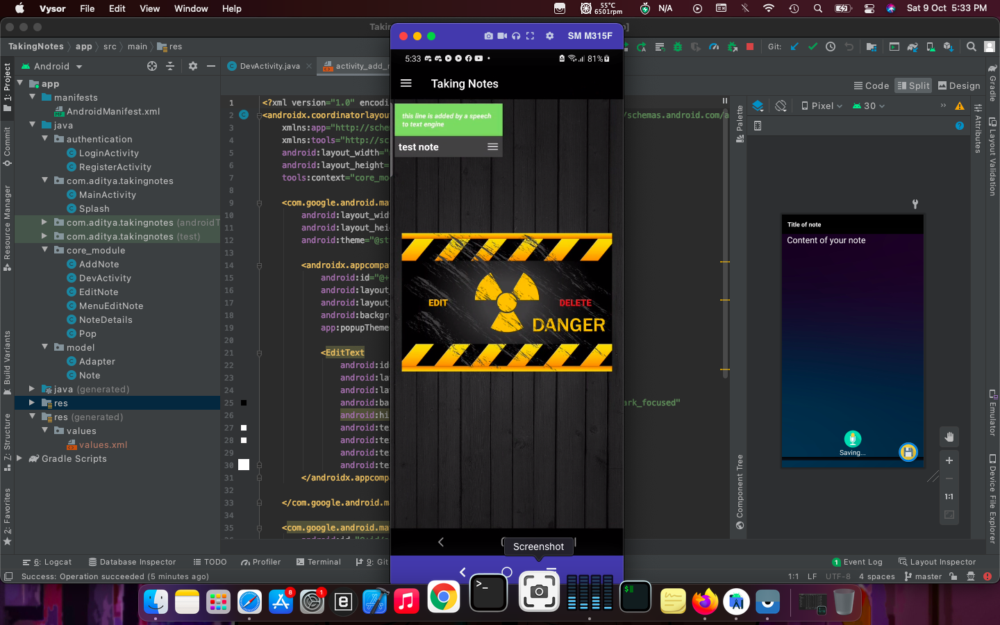
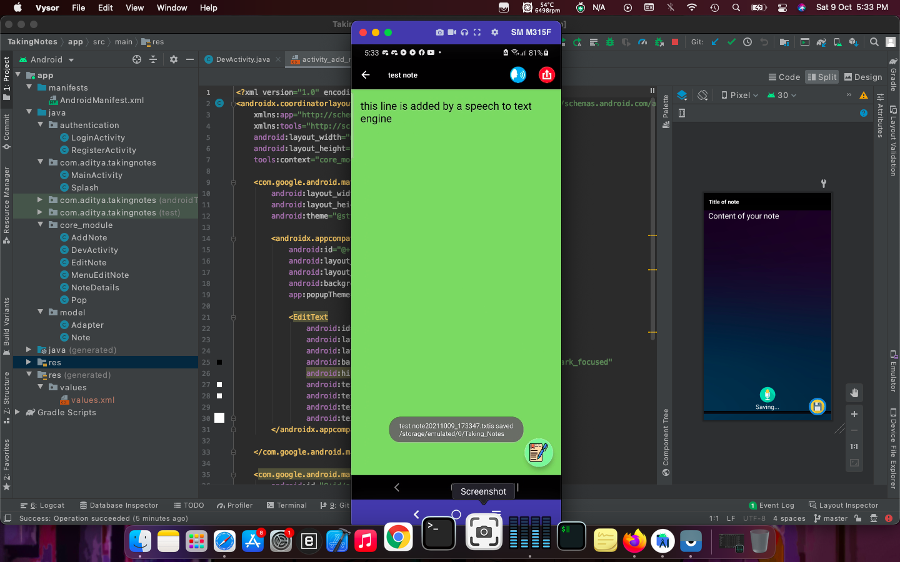
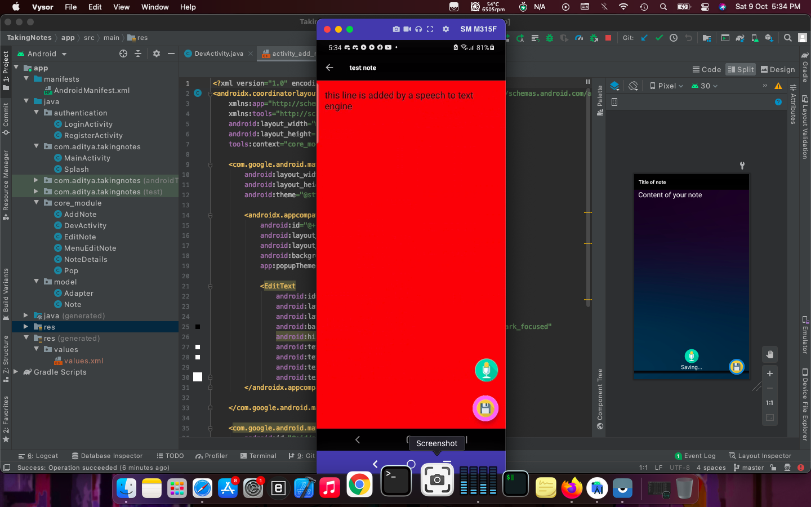

# NOTE-using-firebase
This is a simple Notes app that uses Firebase online database For storing Notes it does not have Image support 
I have speech to text and text to speech engines built in for dictation and reading feature
NOTE:- you have to create your account in this app before you can save important notes 

Here are some i preview images

