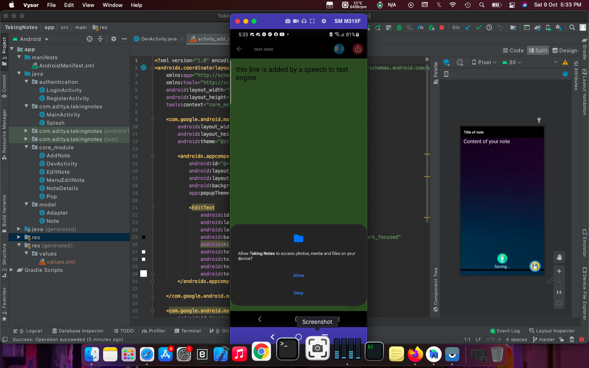

# NOTE-using-firebase
This is a simple Notes app that uses the firebase online database for storing notes in the cloud.
I have speech-to-text and text-to-speech engines built-in for dictation and reading features.

Here are some i preview images

